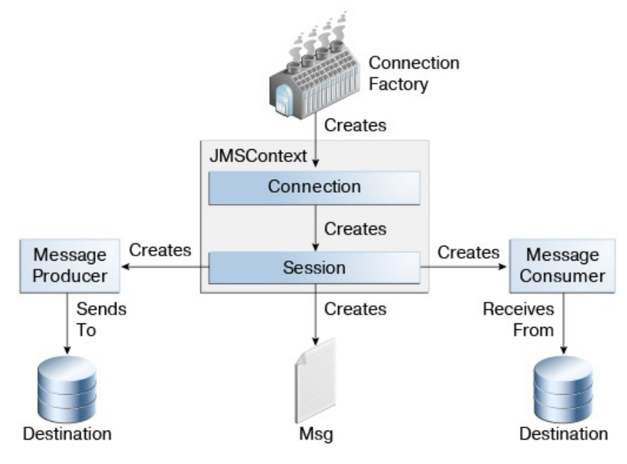

# Message Queue

### 作用

+ 解耦，比如很多模块都需要订单数据，订单模块如果需要和需要订单的这些模块交互的话会非常麻烦。但是通过消息队列，订单模块可以把订单数据直接放到消息队列中，订阅的人自己去取。实现了解耦。(对于消息的生产者而言屏蔽了消息的消费者)

+ 异步，提高吞吐量，防止高流量下系统崩溃

### JMS



代码：

##### 生产者

```java
jmsMessagingTemplate.convertAndSend("order", orderInfo);
```

##### 消费者

```java
@JmsListener(destination = "order")
public void handleOrderMessage(OrderInfo orderInfo){
    System.out.println("Listener received :" + orderInfo.toString());
    userOrderService.placeOrder(orderInfo);
}
```

