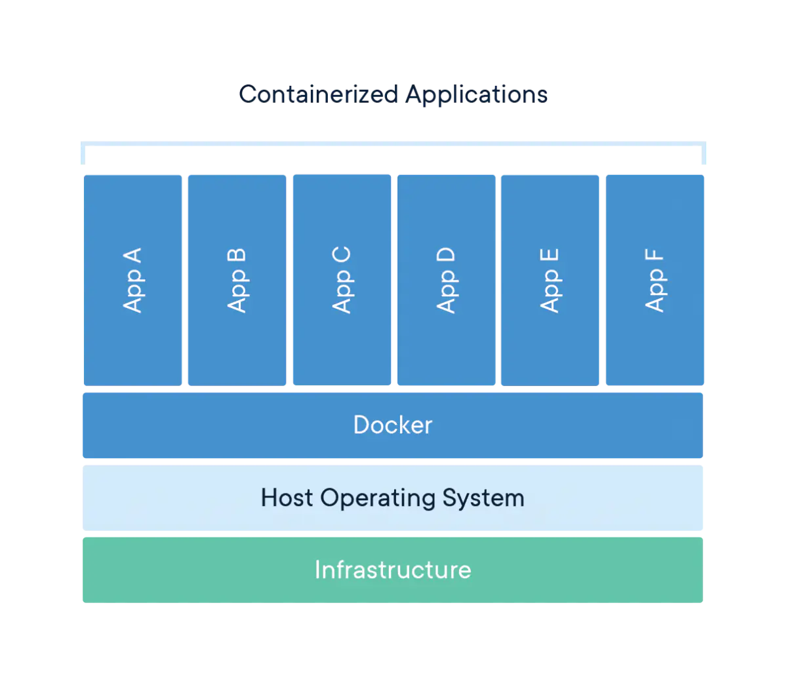
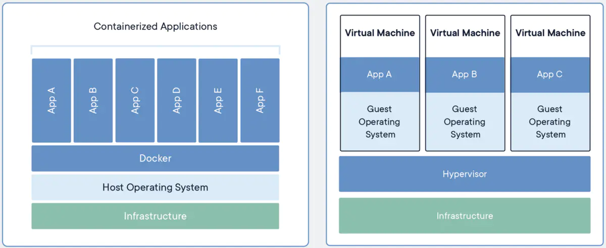
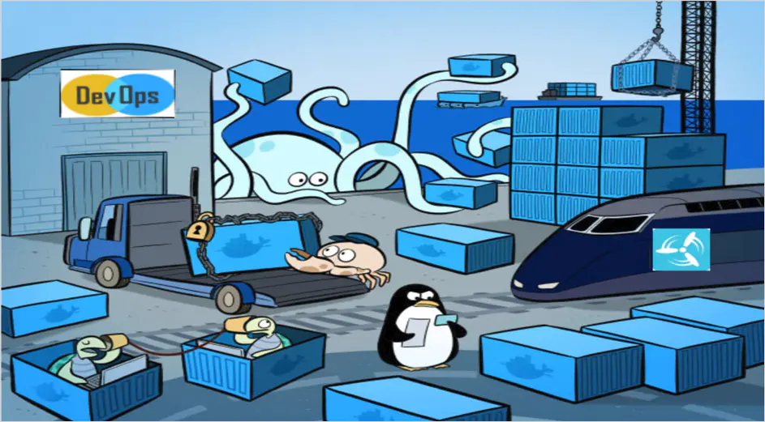
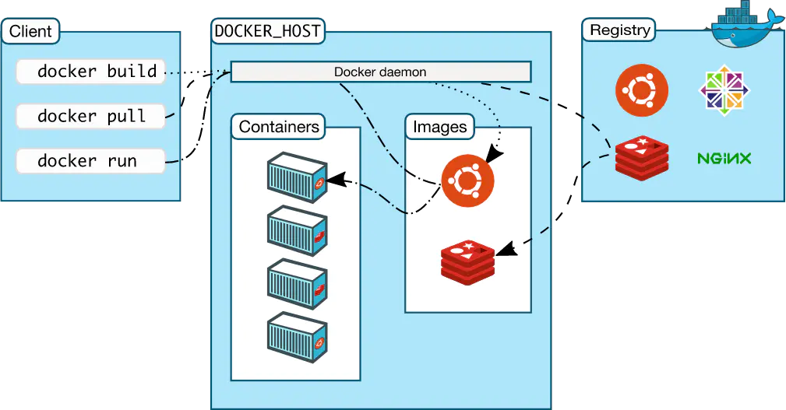

# Virtualization

## 虚拟机

虚拟机（virtual machine）就是一种自带环境安装的解决方案。它可以在一个操作系统里面运行另一个操作系统，比如在 Windows 系统里运行一个 Linux 的操作系统。

应用程序对虚拟机是毫无感知的，因为虚拟机看上去跟真实的操作系统一模一样，而且对于底层的系统来说，虚拟机就是一个普通文件，不需要了就删除，对其他部分毫无影响。

虽然用户可以通过虚拟机还原软件的原始环境。但是，该方案有以下的几个缺点：

**1. 资源占用多**

虚拟机会独占一部分本属于操作系统的内存和硬盘空间。它运行的时候，其他程序就不能使用这些资源了。哪怕你想在虚拟机里面使用的应用程序它实际只会占用 1MB 的内存，虚拟机仍然需要几百 MB 的内存才能运行。

**2. 冗余步骤多**

虚拟机是完整的操作系统，一些系统层面上的操作步骤，往往无法跳过，比如用户登录。

**3. 启动慢**

启动操作系统需要多久，启动虚拟机就需要多久。可能要等几分钟，才能让应用程序真正的运行起来。

## Linux 容器

由于虚拟机存在上述的这些缺点，Linux 提出了另一种虚拟机化技术：Linux 容器（Linux Containers，缩写 LXC）。

**Linux 容器不是模拟一个完整的操作系统，而是对进程进行隔离。**或者说，在正常进程的外面套了一个保护层。对于容器里面的进程来说，它接触到的各种资源都是虚拟的，从而实现与底层系统的隔离。

由于容器是进程级别的，相比虚拟机有很多优势。

**1. 启动快**

容器里面的应用，直接就是底层系统的一个进程，而不是虚拟机内部的进程。所以，启动容器相当于启动本机的一个进程，而不是启动一个操作系统，速度就快很多。

**2. 资源占用少**

容器只占用需要的资源，不占用那些没有用到的资源；虚拟机由于是完整的操作系统，不可避免要占用所有资源。另外，多个容器可以共享资源，虚拟机都是独享资源。

**3. 体积小**

容器只要包含用到的组件即可，而虚拟机是整个操作系统的打包，所以容器文件比虚拟机文件要小很多。

总之，容器有点像轻量级的虚拟机，能够提供虚拟化的环境，但是成本开销小得多。

# 二、什么是 Docker？

------

> **Enterprise Container Platform for High-Velocity Innovation**
>  Securely build, share and run any application, anywhere
>
> 译：
>  **企业高速容器平台**
>  在任何地方安全的建造、分享、运行你的应用程序

官方对 Docker 的定义是一个容器平台。简单来说，**Docker 属于 Linux 容器的一种封装，提供简单易用的容器使用接口。**它是目前最流行的 Linux 容器解决方案。开发人员可以利用 Docker 来消除协作编码时 “在我的电脑上可以正常工作” 的问题。

Docker 将应用程序与该程序的依赖，打包在一个文件里面。运行这个文件，就会生成一个虚拟容器。程序在这个虚拟容器里运行，就好像在真实的物理机上运行一样。有了 Docker，就不用担心环境问题。

总体来说，Docker 的接口相当简单，用户可以方便地创建和使用容器，把自己的应用放入容器。容器还可以进行版本管理、复制、分享、修改，就像管理普通的代码一样。

## 为什么要使用 Docker？

Docker 是一个为开发者和运维者去开发、发布和在容器中运行应用的平台。使用 Linux 容器来部署应用程序被称为容器化。 容器不是新的概念，它的优势在于很容易发布一个应用。

容器化变得非常的流行，因为容器化具有以下的优点：

- 灵活：即使最复杂的应用也能够被容器化。
- 轻量：容器最大化利用和分享主机的内核。
- 可互换：你可以即时部署更新和升级应用。
- 便捷：你可以在本地构建应用，并部署到容器云，并在任何地方运行。
- 可扩展：你可以增加和自动分发容器的个数。
- 可堆叠：您可以垂直堆叠服务并即时堆叠服务。

容器除了运行其中应用外，基本不消耗额外的系统资源，使得应用的性能很高，同时系统的开销尽量小。传统虚拟机方式运行 10 个不同的应用就要起 10 个虚拟机，而Docker 只需要启动 10 个隔离的应用即可。

具体说来，Docker 在如下几个方面具有较大的优势。

**1. 更快速的交付和部署**

对开发和运维（devop）人员来说，最希望的就是一次创建或配置，可以在任意地方正常运行。

开发者可以使用一个标准的镜像来构建一套开发容器，开发完成之后，运维人员可以直接使用这个容器来部署代码。 Docker 可以快速创建容器，快速迭代应用程序，并让整个过程全程可见，使团队中的其他成员更容易理解应用程序是如何创建和工作的。 Docker 容器很轻很快！容器的启动时间是秒级的，大量地节约开发、测试、部署的时间。

**2. 更高效的虚拟化**

Docker 容器的运行不需要额外的 hypervisor 支持，它是内核级的虚拟化，因此可以实现更高的性能和效率。

**3. 更轻松的迁移和扩展**

Docker 容器几乎可以在任意的平台上运行，包括物理机、虚拟机、公有云、私有云、个人电脑、服务器等。 这种兼容性可以让用户把一个应用程序从一个平台直接迁移到另外一个。

**4. 更简单的管理**

使用 Docker，只需要小小的修改，就可以替代以往大量的更新工作。所有的修改都以增量的方式被分发和更新，从而实现自动化并且高效的管理。

## Docker VS VM

容器和虚拟机对资源的隔离和分配有相同的优势，但不同的是容器虚拟化操作系统而不是硬件，这使得容器更加的方便和高效。

一个容器是在 Linux 服务本地运行，并和其他的容器共享主机的内核。它运行在一个独立的进程中，相对于其他可执行的进程（比如虚拟机）来说，容器的内存占用空间更小，更加的轻量化。

相比之下，虚拟机（VM）运行一个完整的“客户”操作系统，通过虚拟机管理程序虚拟访问主机资源。 一般来说，虚拟机提供的环境比大多数应用程序需要的资源更多。

由于 Docker 轻量、资源占用少，使得 Docker 可以轻易的应用到构建标准化的应用中。但 Docker 目前还不够完善，比如隔离效果不如 VM，共享宿主机操作系统的一些基础库等；网络配置功能相对简单，主要以桥接方式为主；查看日志也不够方便灵活。

## Docker 的用途

Docker 的主要用途，目前有三大类。

**1. 提供一次性的环境。**比如，本地测试他人的软件、持续集成的时候提供单元测试和构建的环境。

**2. 提供弹性的云服务。**因为 Docker 容器可以随开随关，很适合动态扩容和缩容。

**3. 组建微服务架构。**通过多个容器，一台机器可以跑多个服务，因此在本机就可以模拟出微服务架构。

# 三、Docker 基本概念

------

下面这张图非常的经典，很形象地展示了，什么是容器，什么是镜像，什么是仓库，以及三者之间的联系。

接下来我们来解释一下这张图。现在我们要造一间厨房，在造之前我们首先要干的一件事，就是先列举出我们造厨房需要的东西。我们可能需要一个通了水电煤的房子以及一些必需的厨房用具诸如锅碗瓢勺、煤气灶、冰箱、水槽等等这些东西。现在我们知道需要了什么东西之后，我们就去找这些东西。首先我们先去京东购买一些厨房用具，这些用具就好比我们的Docker镜像，我们厨房的用具到了之后得找个地方把它们放在，不可能随处丢吧，不然后面用的时候就找不到它了，那么我们Docker镜像也是这样，需要一个Docker仓库去存储这些镜像。现在我们有了这些厨房用具之后就可以做饭了吗？答案当然是不能，没水没电没火啊！这时候我们得把厨房用具给装到一个通了水电煤的房子才行，那么Docker镜像也是这样，单纯的Docker镜像是不能用的，它得装到Docker容器中通了水电煤才能使用。等我们装好了厨房用具之后我们就可以开始做饭，那么我们的Docker镜像装到Docker容器之后，我们应用就可以跑起来了。

## 概念详解

Docker是CS架构，主要有两个概念：

- **Docker daemon:** 运行在宿主机上，Docker守护进程，用户通过Docker client(Docker命令)与Docker daemon交互
- **Docker client:** Docker 命令行工具，是用户使用Docker的主要方式，Docker client与Docker daemon通信并将结果返回给用户，Docker client也可以通过socket或者RESTful api访问远程的Docker daemon

了解了Docker的组成，再来了解一下Docker的三个主要概念：

- **Docker image：** 镜像是只读的，镜像中包含有需要运行的文件。镜像用来创建container，一个镜像可以运行多个container；镜像可以通过Dockerfile创建，也可以从Docker hub/registry上下载。
- **Docker container：** 容器是Docker的运行组件，启动一个镜像就是一个容器，容器是一个隔离环境，多个容器之间不会相互影响，保证容器中的程序运行在一个相对安全的环境中。
- **Docker hub/registry:** 共享和管理Docker镜像，用户可以上传或者下载上面的镜像，也可以搭建自己私有的Docker registry。

镜像就相当于打包好的版本，镜像启动之后运行在容器中，仓库就是装存储镜像的地方。

### 摘自

[了解【Docker】从这里开始](https://www.jianshu.com/p/502b53552e8b?utm_campaign=maleskine&utm_content=note&utm_medium=seo_notes&utm_source=recommendation)
