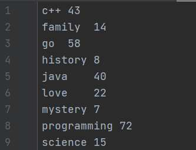

# 说明文档

### 准备工作

+ 构造的简介位于data文件夹内，分为四个文件，分别为CS.txt, Fiction.txt, Horror.txt 和Mystery.txt。

+ 关键词列表没有单独存放在一个文件中，而是以静态形式存放在KeywordCount类中，具体数据如下所示：

  ```java
  private static final HashSet<String> givenKeywords = new HashSet<>() {{
      add("c++");
      add("java");
      add("go");
      add("programming");
      add("family");
      add("science");
      add("love");
      add("mystery");
      add("history");
  }};
  ```

+ Mapper

  map函数

  ```java
  public void map(Object key, Text value, Context context) throws IOException, InterruptedException {
      StringTokenizer itr = new StringTokenizer(value.toString());
      while (itr.hasMoreTokens()) {
          String token = itr.nextToken().trim().toLowerCase();
          if (token.startsWith("(") || token.startsWith("\"") || token.startsWith("'"))
              token = token.substring(1);
          if (token.endsWith(")") || token.endsWith(",") || token.endsWith("\"") || token.endsWith("'"))
              token = token.substring(0, token.length() - 1);
          if (KeywordCount.givenKeywords.contains(token)) {
              word.set(token);
              context.write(word, one);
          }
      }
  }
  ```

  首先利用如下语句把token转换成小写、无前后空格的形式，便于判断是否在给定的关键词列表（集合）中。

  ```java
  String token = itr.nextToken().trim().toLowerCase();
  ```

  接着处理标点符号带来的问题：比如"ABC ABC, ABC" 这样的单词，将其均转换为ABC，以防统计遗漏。

  ```java
  if (token.startsWith("(") || token.startsWith("\"") || token.startsWith("'"))
      token = token.substring(1);
  if (token.endsWith(")") || token.endsWith(",") || token.endsWith("\"") || token.endsWith("'"))
      token = token.substring(0, token.length() - 1);
  ```

  最后，预处理结束，判断是否当前token位于所给定的关键词列表当中。若是，则添加到context中去。

  ```java
  if (KeywordCount.givenKeywords.contains(token)) {
      word.set(token);
      context.write(word, one);
  }
  ```

+ Reducer

  reduce函数

  和word count一样，简单求和：

  ```java
  public void reduce(Text key, Iterable<IntWritable> values, Context context) throws IOException, InterruptedException {
      int sum = 0;
      for (IntWritable val : values) {
          sum += val.get();
      }
      result.set(sum);
      context.write(key, result);
  }
  ```

+ Combiner

  注意到这本质上就是一个特殊的word count，所以combiner和reducer的逻辑是一样的，故使用相同的类。

### 参数设置

由于整体的数据量比较小，四个文件的大小均只有KB级别，所以MapReduce任务基本上一瞬间就做完了，使用默认的参数就会有很好的效果，对参数的调整对整体性能的提升并不明显，但是我还是做了一些实验和尝试。

+ 尝试修改***mapreduce.input.fileinputformat.split.maxsize***

  ```java
  FileInputFormat.setMaxInputSplitSize(job, 20 * 1024L);
  ```

  修改这一参数的直接后果就是改变Mapper的数量，事实证明，这样小量级的数据使用更多的mapper是不可取的，因为mapper的setup，中间文件的合并都有一定开销。而这一开销对于数据量小的应用场景而言是比较大的。（实际上我认为这种数据量不用MapReduce显然算的更快。）

+ 尝试修改***mapreduce.reduce.input.buffer.percent***

  该参数用于设定在内存中保存map输出的空间占堆空间的比例，reduce阶段开始时，内存中的map的输出大小不能大于这个值。

  由于数据量比较小，reduce端需要的内存很小，把这个比例提升能够提升一定效率（把数据放在reduce端的内存中，减少磁盘访问次数）。

其余均采用默认参数。

### 运行结果

程序正常退出，并得到输出：



运行时间在2.5s左右。

### Mapper & Reducer

+ Mapper: 由于数据量比较小，我没有设定mapreduce.input.fileinputformat.split.minsize和mapreduce.input.fileinputformat.split.maxsize。Hadoop会以默认的128MB的块大小进行split，我的四个文件大小分别为：

  | 文件        | 大小 |
  | ----------- | ---- |
  | CS.txt      | 34KB |
  | Fiction.txt | 52KB |
  | Horror.txt  | 22KB |
  | Mystery.txt | 5KB  |

  由于4个文件均不足128MB，所以会被分配到4个不同的Mapper上去，故而Mapper的数量为4（一个文件一个Mapper）.

  事实上，Hadoop在Setup的时候也会有一定开销，如果数据量比较小的话，setup的时间可能会占较大的比例。事实上，应该保证文件有GB级别甚至TB级别，让每个map任务执行足够长的时间才是最好的。

+ Reducer: 由于数据量比较小，采用默认值，1个。（由于关键词比较少，一个reducer即可。）