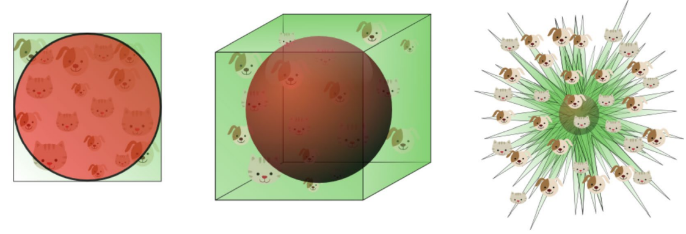

# KNN

### 算法步骤

+ 确定K（最近邻居的数量）；
+ 计算给定查询实例到整个训练集的样本的距离；
+ 对距离排序，获取最近的k个样本；
+ k个样本中最多的那个类即为查询结果；

### 决策边界

Voronoi图，直线上的点到相邻的两个点的距离正好相等。

### Feature Scaling

为了解决某一个特征的数值过大，导致该维成为评估距离的主导因素的情况，通常我们需要对数据进行伸缩。

两种常见的方式：

+ 标准化：$$\mathrm{X}_{\text {norm }}=\frac{\mathrm{X}-\mu}{\sigma}$$

+ Min-Max Scaling：$$x_{\text {morm }}=\frac{x-x_{\min }}{x_{\max }-x_{\min }}$$

### 衡量距离

+ 曼哈顿距离：$$\left|x_{1}-x_{2}\right|+\left|y_{1}-y_{2}\right|$$

+ 明科夫斯基距离：$$D(x, y)=\left(\sum_{u=1}^{n}\left|x_{u}-y_{u}\right|^{p}\right)^{\frac{1}{p}}$$

+ 余弦相似度：$$\frac{x_{1} x_{2}+y_{1} y_{2}}{\sqrt{x_{1}^{2}+y_{1}^{2}} \times \sqrt{x_{2}^{2}+y_{2}^{2}}}$$

#### 分析

+ 欧氏距离对于高维度数据而言不是一个很好的衡量标准；
+ 当训练样本数量不变，增加数据的维度（增加样本的特征），模型的表现会先升高达到最优值，随后不断缩减；过度提升维度可能会导致过拟合，模型开始尝试捕捉一些训练集里的特例情况。

+ 事实上没有固定的标准决定应该用多少维度的特征，这依赖于：
  + 可用的训练数据的数量：数量越少，应该使用的特征就越少；
  + 决策边界的复杂度；
  + 使用的分类器类型：那些倾向于精确建立非线性决策边界的分类器（比如神经网络，KNN和决策树）易于过拟合；对于那些容易泛化的分类器（贝叶斯，线性分类器）而言，特征的数量可以更多一点。
  + 使用诸如K折交叉验证的方式能够预防过拟合：初始采样分割成K个子样本，一个单独的子样本被保留作为验证模型的数据，其他K-1个样本用来训练。交叉验证重复K次，每个子样本验证一次，平均K次的结果或者使用其它结合方式，最终得到一个单一估测。这个方法的优势在于，同时重复运用随机产生的子样本进行训练和验证，每次的结果验证一次，10折交叉验证是最常用的。

+ Bias和Variable是一对trade-off。对于KNN而言，具有低bias高variable的特点。可以通过增大k的值减少variable，但是相应的bias会提升。

### Pros and Cons

#### Advantage

+ KNN在进行决策前不需要训练。因而加入新数据很简单，并且不会影响准确率；
+ KNN非常容易实现，只需要决定K和使用的距离评估函数。

#### Disadvantage

+ 对于大数据集而言，KNN需要计算一个点到其他所有点的距离，运算量很大；
+ KNN需要对数据进行标准化，否则会大大影响预测表现。

### 适用场景

文本分类、模式识别、聚类分析，多分类领域

