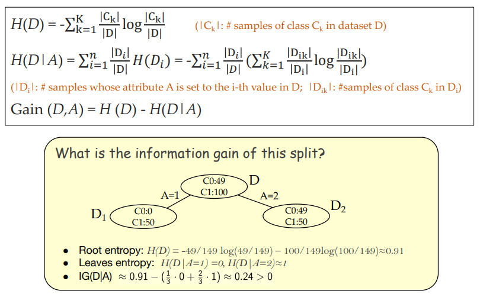
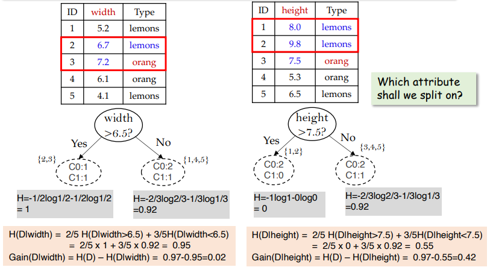
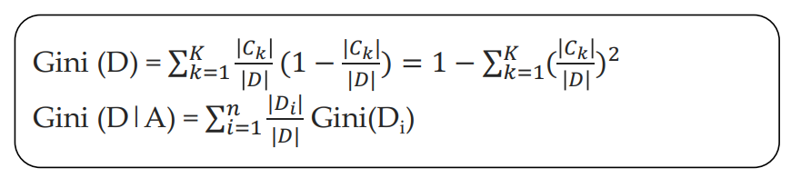
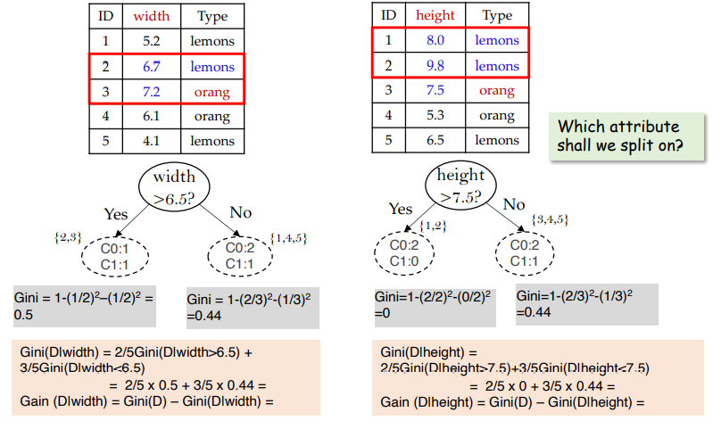
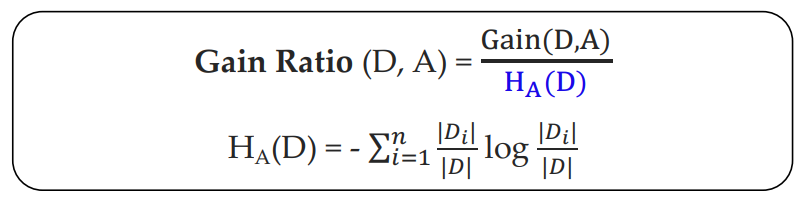
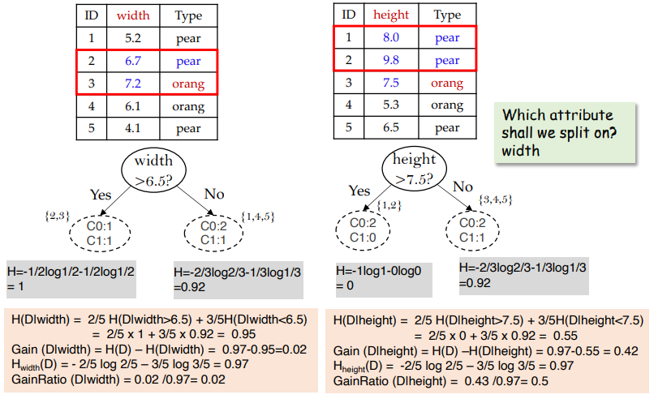
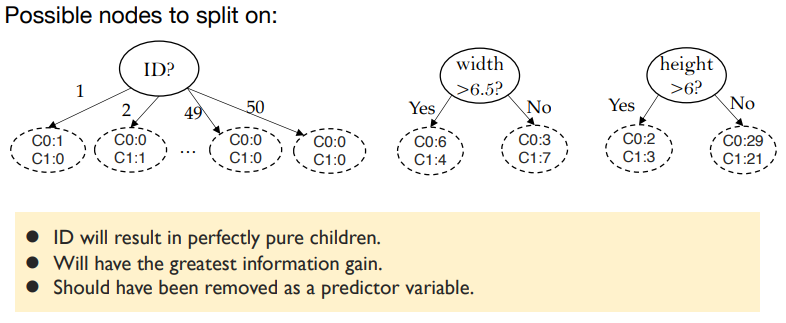
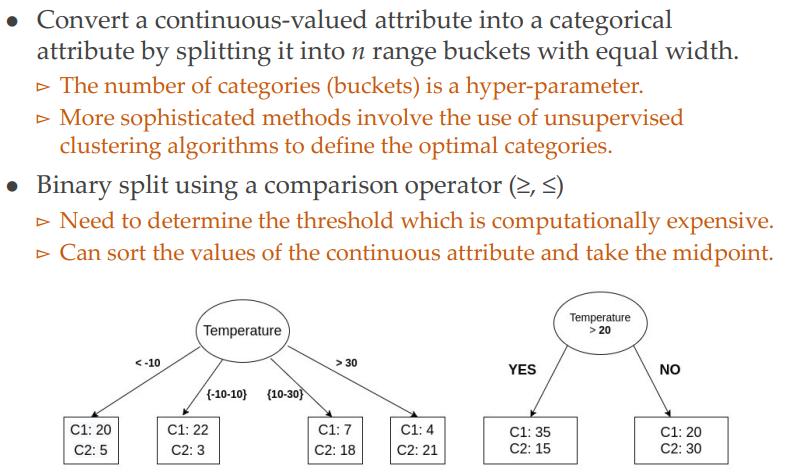
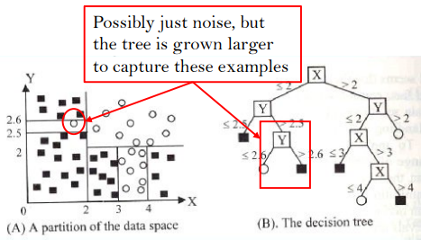

# 决策树

### 流程

+ 创建一个根节点

+ 计算整个数据集的熵

+ 计算每个属性(attribute)对应的IG

+ 选择IG最大的attribute分裂，得到若干个新的分支；

+ 递归地按照上面的方式继续分割子数据集，直到不可分割为止。

### 算法

| 名称 | 公式                                                         | 例子                                                         |
| ---- | :----------------------------------------------------------- | ------------------------------------------------------------ |
| ID3  |  |  |
| CART |  |  |
| C4.5 |  |  |

### 分析

+ Gini本质上代表了两个随机选中的样本来自于不同类的概率。
+ CART比ID3运算简单，因为没有对数运算。

+ ID3和CART对于ID这样对于分类而言没有意义的属性会被选择作为对决策树进行分裂的属性。

+ C4.5惩罚了上述情况。考虑了分裂出的分支数量，计算出分支的熵$$H_A(D)$$，用于修正$$Gain(D,A)$$。对于上面的这种情况，$$H_A(D)$$会很大，从而导致$$Gain(D,A)$$很小，一定程度上避免上述的情况发生。

### Stop Criteria

+ Purity：所有的叶子结点都只包含一个类（即所有的类都分类成功）

+ Minimum number of points：叶子结点中的实例数量小于某个给定的阈值
+ 没有可用于继续划分的attribute 

### Pruning

+ Prepruning：预剪枝，如果goodness measure小于一个给定的阈值，则停止树的增长；
+ Postpruning：后剪枝，当一个树拓展完成之后减去一些不必要的分支
+ 认为后者比前者效果好，但是会耗费更多的计算资源
+ 为什么需要剪枝：预防过拟合，增加泛化能力。

### Splitting Continuous-valued Attributes

### Evaluation

假设测试集为：$$\left\{\left(\mathrm{x}_{1}, \mathrm{y}_{1}\right), \ldots,\left(\mathrm{x}_{\mathrm{n}}, \mathrm{y}_{\mathrm{n}}\right)\right\}$$

则错误率为：$$
\frac{1}{n} \sum_{i=1}^{n} I\left(y_{i} \neq \hat{y}_{i}\right)$$

其中$$\hat{y}_{i}$$是第$$i$$个记录预测的类，$$I()$$是一个指示变量，当$$y_{i} \neq \hat{y}_{i}$$时$$I=1$$，否则为$$0$$

### Pros and Cons

#### Advantages

+ 易于理解、解释和可视化；
+ 数据预处理简单，耗费资源少；
+ 能够产生非线性决策面；
+ 数据驱动，对于训练数据能够给出任意高水平的精确度；

#### Disadvantages

+ 过拟合

  

### 总结

- **划分标准的差异：**ID3 使用信息增益偏向特征值多的特征，C4.5 使用信息增益率克服信息增益的缺点，偏向于特征值小的特征，CART 使用基尼指数克服 C4.5 需要求 log 的巨大计算量，偏向于特征值较多的特征。
- **使用场景的差异：**ID3 和 C4.5 都只能用于分类问题，CART 可以用于分类和回归问题；ID3 和 C4.5 是多叉树，速度较慢，CART 是二叉树，计算速度很快；
- **样本数据的差异：**ID3 只能处理离散数据且缺失值敏感，C4.5 和 CART 可以处理连续性数据且有多种方式处理缺失值；从样本量考虑的话，小样本建议 C4.5、大样本建议 CART。C4.5 处理过程中需对数据集进行多次扫描排序，处理成本耗时较高，而 CART 本身是一种大样本的统计方法，小样本处理下泛化误差较大 ；
- **样本特征的差异：**ID3 和 C4.5 层级之间只使用一次特征，CART 可多次重复使用特征；
- **剪枝策略的差异：**ID3 没有剪枝策略，C4.5 是通过悲观剪枝策略来修正树的准确性，而 CART 是通过代价复杂度剪枝。

