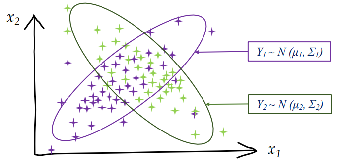
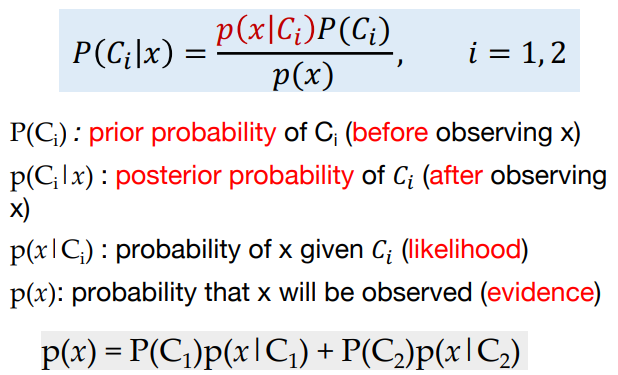
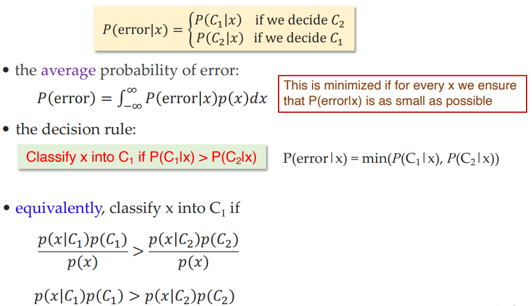
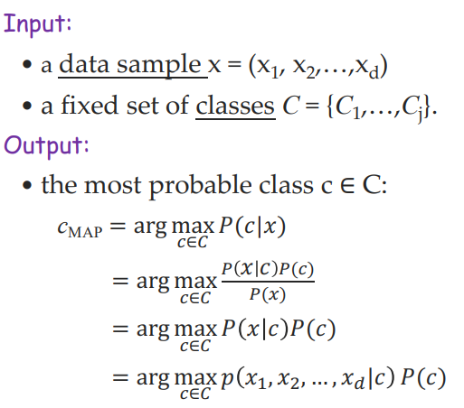
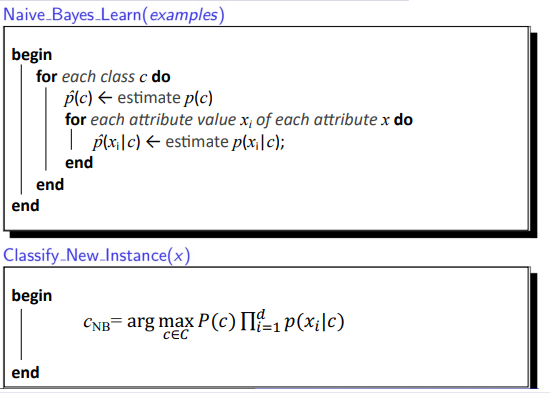
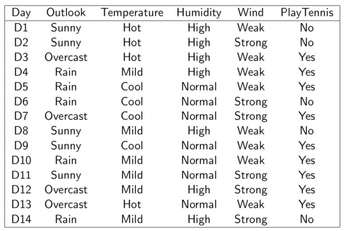
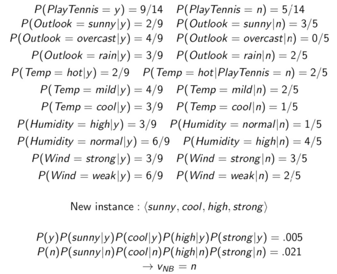
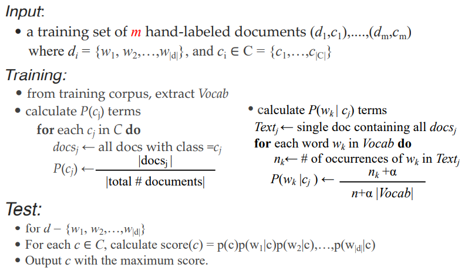
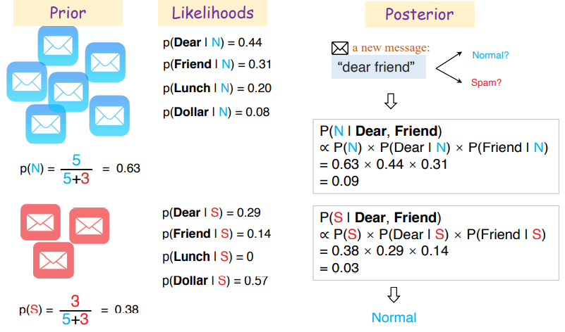

# 贝叶斯分类

### 决策树存在的问题

决策树无法解决以下情况（无法进行线性的递归的划分），但是明显两类数据存在一定的概率分布特征。

### Bayes Rules

    
    

### Special Cases

对于$$\boldsymbol{p}\left(x \mid C_{1}\right) P\left(C_{1}\right)>\boldsymbol{p}\left(x \mid C_{2}\right) P\left(C_{2}\right)$$

有两种特殊情况：

+ $$p\left(x \mid C_{1}\right)=p\left(x \mid C_{2}\right)$$:

  决策完全依赖于先验概率$$P(C_1)$$和$$P(C_2)$$

+ $$P\left(C_{1}\right)=P\left(C_{2}\right)$$:

  决策完全依赖于条件概率$$p(x|C_i)$$

### General Cases

$$
\begin{aligned}
P\left(C_{i} \mid \mathbf{x}\right) &=\frac{p\left(\mathbf{x} \mid C_{i}\right) P\left(C_{i}\right)}{p(\mathbf{x})} \\
&=\frac{p\left(\mathbf{x} \mid C_{i}\right) P\left(C_{i}\right)}{\sum_{k=1}^{K} p\left(\mathbf{x} \mid C_{k}\right) P\left(C_{k}\right)}
\end{aligned}
$$

Choose $$C_i$$ if $$P\left(C_{i} \mid \mathbf{x}\right)=\max _{k} P\left(C_{k} \mid \mathbf{x}\right)$$

### Bayes Network

对于$$p(c)$$比较容易求得，只需通过计数即可。但是对于$$p(x_1,x_2,...x_d|c)$$而言，就会非常复杂。

### 朴素贝叶斯

朴素贝叶斯假设$$x_1,x_2,...x_d$$之间是独立的，即$$p(x_1,x_2,...x_d|c)=p(x_1|c)p(x_2|c)...p(x_d|c)$$

这样复杂的计算就得到了化简：

From:
$$
c_{\mathrm{MAP}}=\arg \max _{c \in C} p\left(x_{1}, x_{2}, \ldots, x_{\mathrm{d}} \mid c\right) \mathrm{P}(c)
$$
To:
$$
c_{\mathrm{NB}}=\arg \max _{c \in C} P(c) \prod_{i=1}^{d} p\left(x_{i} \mid c\right)
$$
$$p(x_i|c)$$可以通过以下方式估算：
$$
\widehat{P}\left(x_{i} \mid c\right) \leftarrow \frac{\operatorname{count}\left(x_{i}, c\right)}{\sum_{x \in|x|} \operatorname{count}(x, c)}
$$
### 处理Zero Counts问题

注意到，对于
$$
c_{\mathrm{NB}}=\arg \max _{c \in C} P(c) \prod_{i=1}^{d} p\left(x_{i} \mid c\right)
$$
只要有一项$$p(x_i|c)=0$$，那么整体就会等于0。注意到，这是因为我们在通过计数的方式估算$$p(x_i|c)$$，所以很容易出现数据集中在给定$$c$$的情况下，$$x_i$$出现的次数为零的情况。

所以我们可以使用***Laplace Smoothing***:
$$
\hat{P}\left(x_{i} \mid c\right) \leftarrow \frac{\operatorname{count}\left(x_{i}, c\right)+1}{\sum_{x \in|x|}(\operatorname{count}(x, c)+1)}
$$
本质上就是在之前的式子上下同时加1做了一个近似，但是这保证了$$p(x_i|c)\neq 0$$恒成立。

### 整体流程

### Example

    
    

### 处理连续值

把连续值拆分成长度相等的区间即可。

### Pros and Cons

+ 优点
  + 训练和测试都非常快。训练的计算量很小。
  + 当独立的假设成立的时候，NB的表现会更好；在多类型预测的表现上也不错；
  + 易于维护，对于删除和添加数据集的数据的情况比较好处理（重新计数即可）。

+ 缺点
  + 朴素贝叶斯的核心在于我们假设**属性**$$x_i$$**之间是相互独立的**，但往往事实并非如此，显然两个属性之间存在一定联系，这会带来一定误差；
  + 朴素贝叶斯分类器的复杂度是固定的而且比较低，所以可能会导致**欠拟合**（为了解决这种方法可以重新引入贝叶斯网络）；

### 应用场景

+ 实时预测（因为NB的运行效率很高）；
+ 多类型预测；
+ 文字分类，比如垃圾邮件的判定。

### Example of Spam Filtering

    
    

